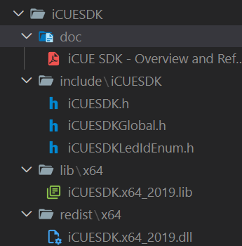
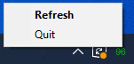

# CORSAIR Battery Level Reader
Get the exact battery level of your Corsair devices using the official iCUE SDK (C API) via Python ctypes.

Hello, this is a small side project I put together because it annoyed me that the Corsair iCUE app only uses general status tiers (High, Medium, Low) rather than an exact percentage. To fix this, I developed my own solution: a Python wrapper for the iCUE SDK that tracks the exact battery level of your wireless headset and displays it conveniently in a Windows system tray icon.


# Intention
My goal isn't to provide a polished, one-click installer, but rather to share the code and my methodology so anyone with a bit of programming knowledge can use, adapt, or improve it.

I have only tested this with my Virtuoso RGB Wireless XT Headset, but theoretically, it should work with any supported wireless Corsair device.

Note: I used AI to help develop the wrapper, which significantly sped up the process. Also, keep in mind that the PDF documentation included with the iCUE SDK does not always match the actual SDK code, always trust the source code over the PDF.

# Requirements

The app will work only for Corsair devices that expose the iCUE SDK property CDPI_BatteryLevel (property id 9). Wired devices or devices that do not report that property will not show a percentage.

To list detected devices and print either a battery percentage or "battery property not available" for each device. 

```
python battery_reader.py --verbose
```

To target one device:

```
python battery_reader.py --device-index 0 --verbose
```

Replace the index number `0` with your target devide index.

## Prerequisites

1. **iCUE must be running**.

2. **Python**: Of course you need python, I recommend the latest python 3.12 release or above, you can get it from here: https://www.python.org/downloads/windows/

3. **ICUE SDK**: You have to download the official ICUE SDK from Corsair https://github.com/CorsairOfficial/cue-sdk/releases. Extract it it into a convenient folder, I recommend placing it right in the root folder of this project. It should contain the following files and folders::



The wrapper actively tries several methods to locate the `CUESDK.x64_2019.dll` file. If you placed the SDK folder in the project root, it should find it automatically. Alternatively, you can specify the exact DLL path using an environment variable named `CUE_SDK_DLL`, e.g. `set CUE_SDK_DLL=C:\path\to\iCUESDK.x64_2019.dll`.


# Build
While not strictly mandatory, it is highly recommended to set up a Python virtual environment so you don't clutter your global configuration.

Open PowerShell in the root folder of the project and execute:

```python
# Create the virtual environment
python -m venv .venv

# Activate the virtual environment
.venv\Scripts\Activate.ps1
```

I also recommend packaging the project using PyInstaller, which bundles everything into a single, clean `.exe` file so you don't have to run it through a terminal every time.

```python
pip install pyinstaller
```

Use the following command to build the project into a `.exe`:

```python
# Install PyInstaller
pip install pyinstaller

# Build the executable (Replace you ICUE dll folder if needed)
pyinstaller --noconfirm --onefile --windowed  --add-data 'iCUESDK\redist\x64\iCUESDK.x64_2019.dll;.' battery_tray_app.py
```

Once the build finishes, you can find your newly created `.exe` inside the `dist` folder. Once the build finishes, you can find your newly created

```python
deactivate
```

# Usage
Simply run your `.exe` and the battery tray icon should appear in the lower-right corner of your Windows taskbar.

**Important**: You may need to manually grant the Battery Tray App access inside the iCUE software:


---

The App lets you know when your battery has fallen below 20% or higher than 80% (Battery health matters to me).

Right click it to refresh and show a notification:



Left click it to show a dropdown meny with the `Refresh` and `Exit` options.


# Known limitations

**Sudden Drops**: Sometimes the battery percentage will suddenly drop from a high value (e.g., 80% - 90%) to a low value (10% - 20%). I don't know the exact cause of this yet, but I suspect it's an issue with how the iCUE software reports the data.

**Manual Startup**: You have to start the app after booting up your system in order to work, I haven't found a definitve solution for automatically starting the app at start up, but the `Task Scheduler` could be a good option.
